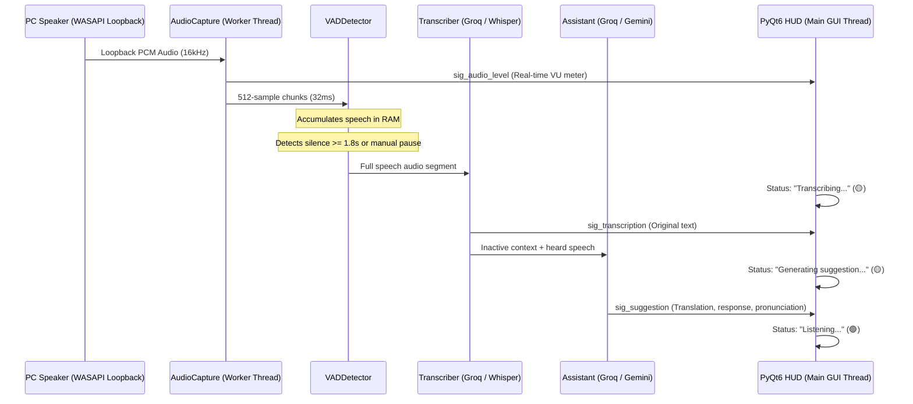

# LiveCopilot ⚡

> **Real-Time Desktop Audio AI Copilot for Windows**: Captures PC audio output (WASAPI Loopback), transcribes and translates speech in real time (meetings, classes, calls, videos), and provides instant smart suggestions with pronunciation guides inside a sleek, frameless 60 FPS translucent HUD.

[](https://www.python.org/)
[](LICENSE)
[](https://www.microsoft.com/windows)
[](https://riverbankcomputing.com/software/pyqt/)

---

## 🌟 Key Features

1. **WASAPI Loopback Internal Audio Capture (`soundcard`)**:
   - Records directly from the Windows speaker output at 16,000 Hz Mono (`float32`).
   - Non-blocking circular queue buffer in RAM with automatic lag and overflow mitigation.
   - Dynamic audio device switching from the visual settings dialog.

2. **Voice Activity Detection (VAD)**:
   - Deep-learning **Silero-VAD** (PyTorch) with adaptive RMS energy fallback.
   - Pre-roll circular buffer (320 ms) to protect initial consonants from being cut.
   - Smart pause segmentation (1.8s default, configurable up to 2.5s for lectures) to capture complete paragraphs without cutting mid-sentence.
   - **Manual Pause Flush**: Pressing `⏸ Pause` instantly flushes and processes whatever was spoken up to that exact moment.

3. **Ultra-Low Latency STT Dual-Engine**:
   - **Primary (Cloud, <300ms)**: Groq API with `whisper-large-v3` running in RAM via `io.BytesIO` (zero disk write latency).
   - **Fallback (Local)**: `faster-whisper` (`base`/`small` with CTranslate2 CUDA float16 or CPU int8).

4. **Conversational LLM Copilot**:
   - Groq (`llama-3.3-70b-versatile` / `llama-3.1-8b-instant`) or Google Gemini (`gemini-2.5-flash`).
   - Generates natural, concise conversational replies with phonetic pronunciation guides and translation.
   - Rolling sliding-window history for multi-turn meeting context.

5. **Glassmorphic Floating HUD (PyQt6)**:
   - Frameless, translucent dark-mode window (`rgba(18, 18, 18, 0.90)`) with `WindowStaysOnTopHint`.
   - Windows taskbar integration (`WS_EX_APPWINDOW`, `AppUserModelID`) and interactive minimize/restore (`🗕`).
   - Bottom-right corner resize grip (`QSizeGrip`).
   - Live VU audio level meter and latency metrics in milliseconds.
   - One-click copy button for suggested responses.

---

## ⚡ Concurrency & Data Flow Architecture



---

## 📁 Project Structure

```text
LiveCopilot/
├── src/
│   ├── __init__.py
│   ├── audio_capture.py    # Background WASAPI Loopback recorder
│   ├── vad_detector.py     # Silero-VAD + RMS energy segmentation & flush
│   ├── transcriber.py      # Dual STT engine (Groq Whisper Cloud + local faster-whisper)
│   ├── assistant.py        # LLM Copilot with conversational memory & phonetics
│   ├── settings_dialog.py  # Visual settings modal for API key, audio device & pause timeout
│   └── ui_overlay.py       # 60 FPS glassmorphic floating HUD in PyQt6
├── .env.example            # Environment variables & API configuration template
├── .gitignore              # Strict exclusions (protects local .env and venv/)
├── requirements.txt        # Pinned Python dependencies
├── main.py                 # Multi-threaded concurrent orchestrator (QThread)
└── README.md               # Complete architecture and usage guide
```

---

## 🚀 Installation & Quick Start

### Prerequisites
- **Windows 10 or 11** (64-bit).
- **Python 3.10 or 3.11** installed. (If you don't have it, install with: `winget install Python.Python.3.11`).

---

### Step 1: Clone the Repository

In **PowerShell** or **Command Prompt (CMD)**:
```powershell
git clone https://github.com/Thekrownn/LiveCopilot.git
cd LiveCopilot
```

---

### Step 2: Create & Activate Virtual Environment

#### In PowerShell:
```powershell
# 1. Create virtual environment
python -m venv venv

# 2. Activate virtual environment
.\venv\Scripts\Activate.ps1
```
> *Note:* If PowerShell gives an `ExecutionPolicy` error, run:  
> `Set-ExecutionPolicy -ExecutionPolicy RemoteSigned -Scope Process` and reactivate.

#### In CMD:
```cmd
python -m venv venv
venv\Scripts\activate.bat
```

---

### Step 3: Install Dependencies

```powershell
pip install --upgrade pip
pip install -r requirements.txt
```

---

### Step 4: Configure Environment Variables

Copy the example environment file:
```powershell
cp .env.example .env
```

Edit `.env` or simply configure your API key through the built-in **Visual Settings Dialog (`⚙️`)** on first run.

```env
# Free Groq API Key (Recommended for ultra-low latency <300ms)
# Get yours for free at: https://console.groq.com/keys
GROQ_API_KEY=gsk_your_api_key_here

# Optional: Google Gemini API Key
GEMINI_API_KEY=your_gemini_key_here

STT_MODE=cloud
LLM_PROVIDER=groq
VAD_SILENCE_TIMEOUT_MS=1800
TARGET_LANGUAGE=auto
```

---

### Step 5: Run LiveCopilot

```powershell
.\venv\Scripts\python.exe main.py
```

1. The translucent floating HUD will appear on the bottom-right corner of your screen.
2. Play any video, call, or meeting audio (Zoom, Google Meet, Microsoft Teams, YouTube).
3. The top VU meter reacts to real-time audio. When speech concludes (or when you click `⏸ Pause`), the original transcription, Spanish translation, English response, and phonetic pronunciation guide appear instantly.
4. Drag from the header bar to move the HUD anywhere on screen, or resize from the bottom-right corner.

---

## ⚙️ Configuration Reference

| Parameter | Default | Description |
|---|---|---|
| `GROQ_API_KEY` | `""` | Groq API Key for ultra-fast Whisper cloud inference and Llama-3.3 LLM. |
| `GEMINI_API_KEY` | `""` | Optional Google Gemini API Key for fallback LLM inference. |
| `STT_MODE` | `cloud` | Speech-to-Text mode: `cloud` (Groq API) or `local` (faster-whisper). |
| `FALLBACK_TO_LOCAL`| `true` | Automatically fall back to local Whisper if internet/cloud fails. |
| `VAD_SILENCE_TIMEOUT_MS` | `1800` | Silence duration in ms required to segment speech (1400ms to 2500ms). |
| `VAD_THRESHOLD` | `0.4` | Speech probability threshold for Silero-VAD (0.1 to 0.9). |
| `AUDIO_DEVICE_ID` | `""` | Soundcard loopback device ID (empty for system default). |
| `TARGET_LANGUAGE` | `auto` | Target spoken language detection (`auto`, `en`, `es`). |

---

## 📄 License

This project is licensed under the [MIT License](LICENSE).
