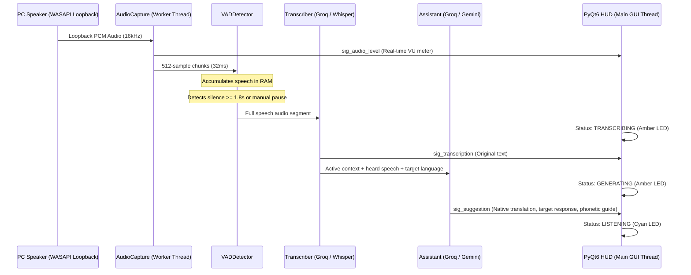

<div align="center">
  
  <h1>LiveCopilot</h1>
  <p><b>Real-Time Desktop Audio AI Copilot for Windows</b></p>
  <p>Ultra-low latency audio stream capture, dual-engine speech-to-text, and conversational intelligence in a 60 FPS floating heads-up display.</p>

  <p>
    <a href="https://www.python.org/"></a>
    <a href="LICENSE"></a>
    <a href="https://www.microsoft.com/windows"></a>
    <a href="https://riverbankcomputing.com/software/pyqt/"></a>
  </p>
</div>

---

## Overview

LiveCopilot captures Windows audio output directly from your soundcard (WASAPI Loopback), segments speech in real time with deep-learning voice activity detection (Silero-VAD), transcribes speech under 300 ms with Groq Whisper Cloud (with automatic offline fallback to local faster-whisper), and generates immediate, culturally authentic response suggestions with phonetic pronunciation guides and native translations.

---

## Key Features

1. **WASAPI Loopback Internal Audio Capture (`soundcard`)**:
   - Records directly from the Windows speaker output at 16,000 Hz Mono (`float32`).
   - Non-blocking circular queue buffer in RAM with automatic lag and overflow mitigation.
   - Dynamic audio device switching from the visual configuration dialog.

2. **Voice Activity Detection (VAD)**:
   - Deep-learning **Silero-VAD** (PyTorch) with adaptive RMS energy fallback.
   - Pre-roll circular buffer (320 ms) to prevent clipping initial consonants.
   - Smart pause segmentation (1.8s default, configurable up to 2.5s for lectures) to capture complete thoughts without mid-sentence interruptions.
   - **Manual Pause Flush**: Clicking `PAUSE` instantly flushes and processes whatever was spoken up to that exact moment.

3. **Ultra-Low Latency STT Dual-Engine**:
   - **Primary (Cloud, <300ms)**: Groq API with `whisper-large-v3` running in RAM via `io.BytesIO` (zero disk write latency).
   - **Fallback (Local)**: `faster-whisper` (`base`/`small` with CTranslate2 CUDA float16 or CPU int8).

4. **Multilingual Conversational LLM Copilot**:
   - Powered by Groq (`llama-3.3-70b-versatile` / `qwen3.8-27b`) or Google Gemini (`gemini-2.5-flash`).
   - **Primary Native Language**: Configure your native language (e.g. Spanish) to always receive translations and meanings in your own tongue.
   - **Dynamic Target Response Language**: Speak back in English, Chinese (Mandarin), French, German, Japanese, Portuguese, Italian, Korean, Russian, Arabic, etc.
   - **On-the-fly HUD Language Switcher**: Change response languages instantly with a single click inside the HUD without opening settings or pausing your meeting.
   - Generates natural replies accompanied by custom phonetic pronunciation guides (such as Pinyin with tones for Chinese or phonetic syllables for English) tailored specifically for your native tongue.

5. **Glassmorphic Floating HUD (PyQt6)**:
   - Frameless, translucent dark-mode window (`rgba(14, 16, 20, 0.94)`) with `WindowStaysOnTopHint`.
   - Windows taskbar integration (`WS_EX_APPWINDOW`, `AppUserModelID`) and interactive minimize/restore.
   - Bottom-right corner resize grip (`QSizeGrip`).
   - Live hardware-style LED status indicator and audio VU level meter.
   - One-click copy button for suggested responses.

---

## Concurrency Architecture



---

## Project Structure

```text
LiveCopilot/
├── assets/
│   ├── logo.png            # High-resolution vector logo
│   └── icon.png            # Window & taskbar icon
├── src/
│   ├── __init__.py
│   ├── audio_capture.py    # Background WASAPI Loopback recorder
│   ├── vad_detector.py     # Silero-VAD + RMS energy segmentation & flush
│   ├── transcriber.py      # Dual STT engine (Groq Whisper Cloud + local faster-whisper)
│   ├── assistant.py        # Multilingual LLM Copilot with dynamic prompt & phonetics
│   ├── settings_dialog.py  # Visual settings modal for API key, audio device & multilingual preferences
│   └── ui_overlay.py       # 60 FPS glassmorphic floating HUD with live language switcher
├── .env.example            # Environment variables & API configuration template
├── .gitignore              # Strict exclusions (protects local .env and venv/)
├── LICENSE                 # Official MIT License
├── requirements.txt        # Pinned Python dependencies
├── main.py                 # Multi-threaded concurrent orchestrator (QThread)
└── README.md               # Architecture and usage documentation
```

---

## Installation & Quick Start

### Prerequisites
- **Windows 10 or 11** (64-bit).
- **Python 3.10 or 3.11** installed. (If needed: `winget install Python.Python.3.11`).

---

### Step 1: Clone the Repository

In **PowerShell** or **Command Prompt (CMD)**:
```powershell
git clone https://github.com/Thekrownn/LiveCopilot.git
cd LiveCopilot
```

---

### Step 2: Create & Activate Virtual Environment

#### In PowerShell:
```powershell
# 1. Create virtual environment
python -m venv venv

# 2. Activate virtual environment
.\venv\Scripts\Activate.ps1
```
> *Note:* If PowerShell reports an `ExecutionPolicy` error, run:  
> `Set-ExecutionPolicy -ExecutionPolicy RemoteSigned -Scope Process` and reactivate.

#### In CMD:
```cmd
python -m venv venv
venv\Scripts\activate.bat
```

---

### Step 3: Install Dependencies

```powershell
pip install --upgrade pip
pip install -r requirements.txt
```

---

### Step 4: Configure Environment Variables

Copy the example environment file:
```powershell
cp .env.example .env
```

Edit `.env` or configure your preferences through the built-in **Visual Settings Dialog** on first run.

```env
# Free Groq API Key (Recommended for ultra-low latency <300ms)
# Get yours for free at: https://console.groq.com/keys
GROQ_API_KEY=gsk_your_api_key_here

# Optional: Google Gemini API Key
GEMINI_API_KEY=your_gemini_key_here

# Multilingual preferences
USER_NATIVE_LANG=Spanish
RESPONSE_LANG=English

STT_MODE=cloud
LLM_PROVIDER=groq
VAD_SILENCE_TIMEOUT_MS=1800
TARGET_LANGUAGE=auto
```

---

### Step 5: Run LiveCopilot

```powershell
.\venv\Scripts\python.exe main.py
```

1. The translucent floating HUD appears in the bottom-right corner of your screen.
2. Play any video, call, or meeting audio (Zoom, Google Meet, Microsoft Teams, YouTube).
3. The top VU meter reacts to real-time audio. When speech concludes (or when you click `PAUSE`), the original transcription, native translation, target response, and phonetic pronunciation guide appear instantly.
4. **Switch Response Language anytime**: Use the dropdown in the HUD to instantly change what language you want to speak back in (e.g. from English to Chinese or French).
5. Drag from the header bar to move the HUD anywhere on screen, or resize from the bottom-right corner.

---

## Configuration Reference

| Parameter | Default | Description |
|---|---|---|
| `GROQ_API_KEY` | `""` | Groq API Key for ultra-fast Whisper cloud inference and Llama-3.3 LLM. |
| `GEMINI_API_KEY` | `""` | Optional Google Gemini API Key for fallback LLM inference. |
| `USER_NATIVE_LANG` | `Spanish` | Your primary native language (understood by you; used for translations and meanings). |
| `RESPONSE_LANG` | `English` | Target language to speak/respond in (can also be changed live in the HUD). |
| `STT_MODE` | `cloud` | Speech-to-Text mode: `cloud` (Groq API) or `local` (faster-whisper). |
| `FALLBACK_TO_LOCAL`| `true` | Automatically fall back to local Whisper if internet/cloud fails. |
| `VAD_SILENCE_TIMEOUT_MS` | `1800` | Silence duration in ms required to segment speech (1400ms to 2500ms). |
| `VAD_THRESHOLD` | `0.4` | Speech probability threshold for Silero-VAD (0.1 to 0.9). |
| `AUDIO_DEVICE_ID` | `""` | Soundcard loopback device ID (empty for system default). |
| `TARGET_LANGUAGE` | `auto` | Spoken audio speech detection language (`auto` detects 99 languages). |

---

## License

This project is licensed under the [MIT License](LICENSE).
